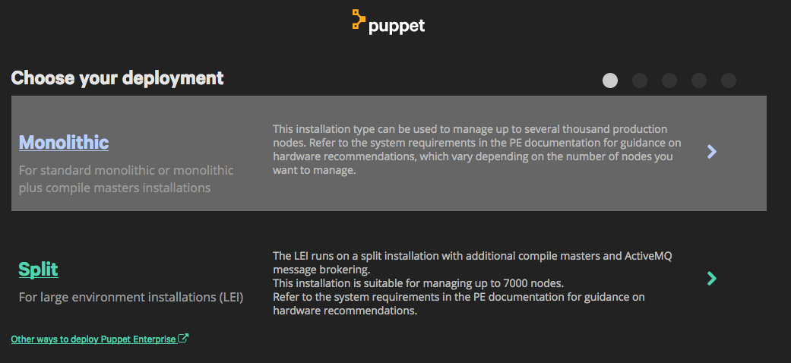
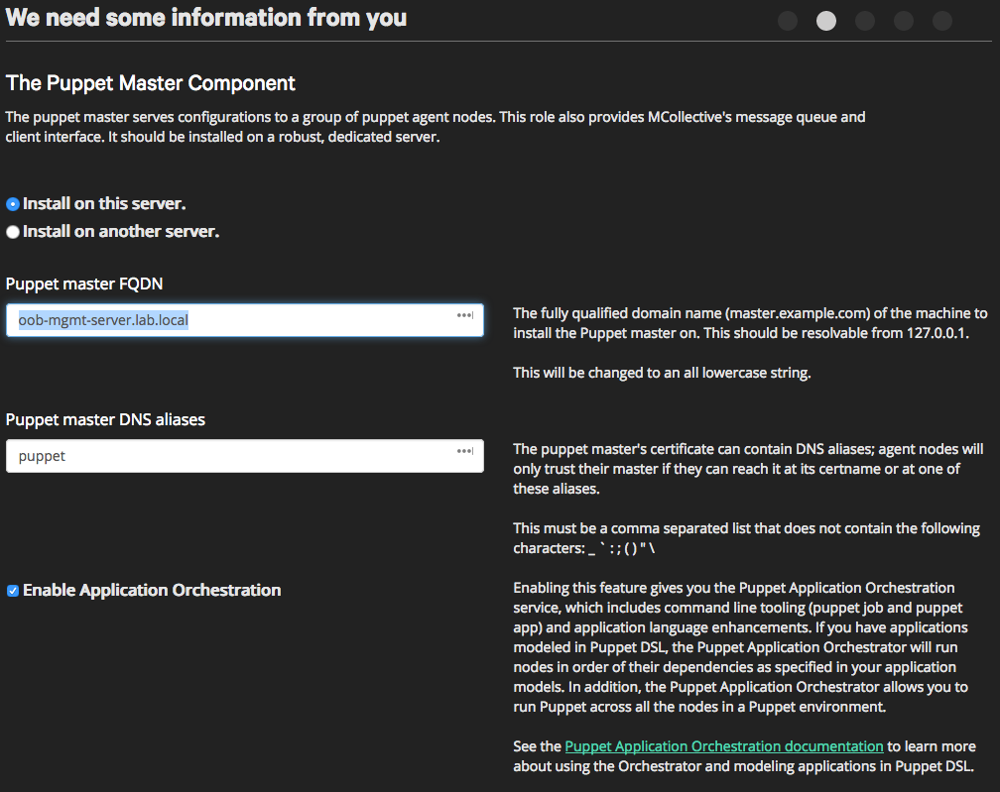
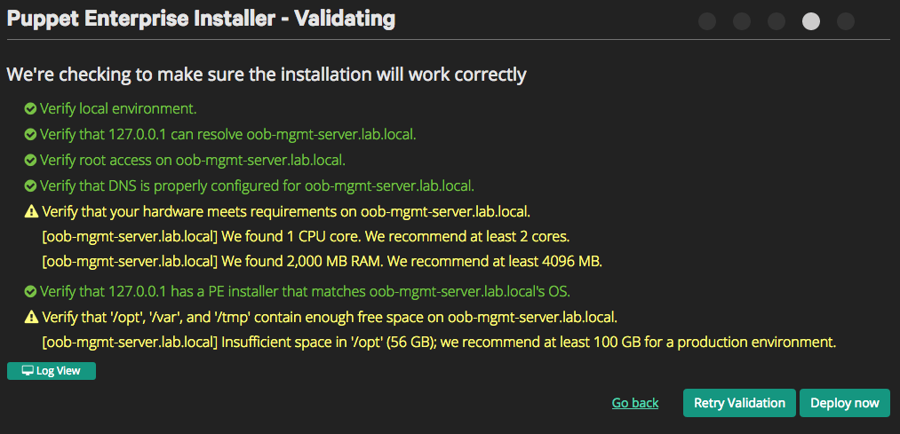
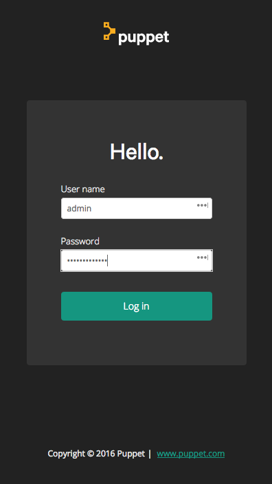
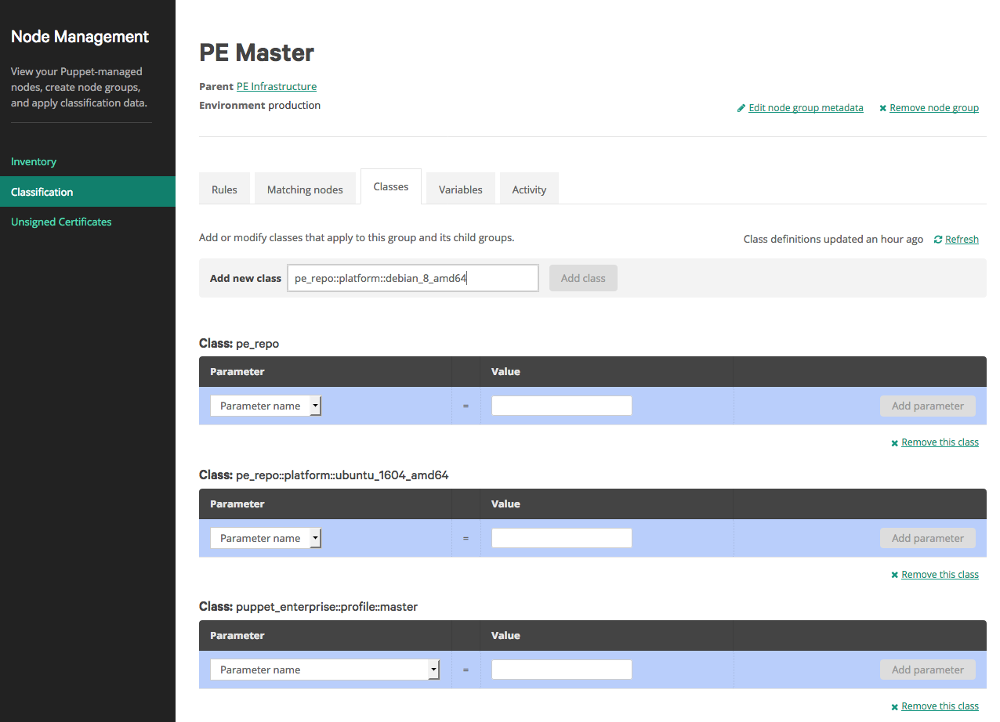
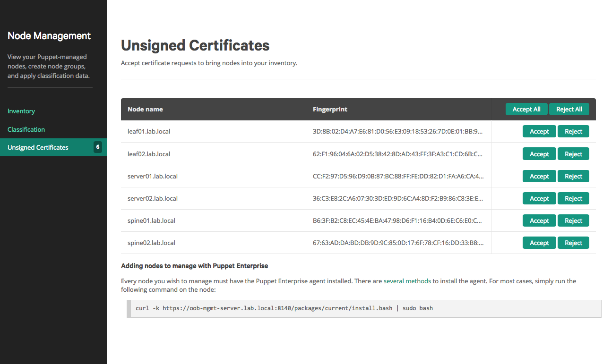
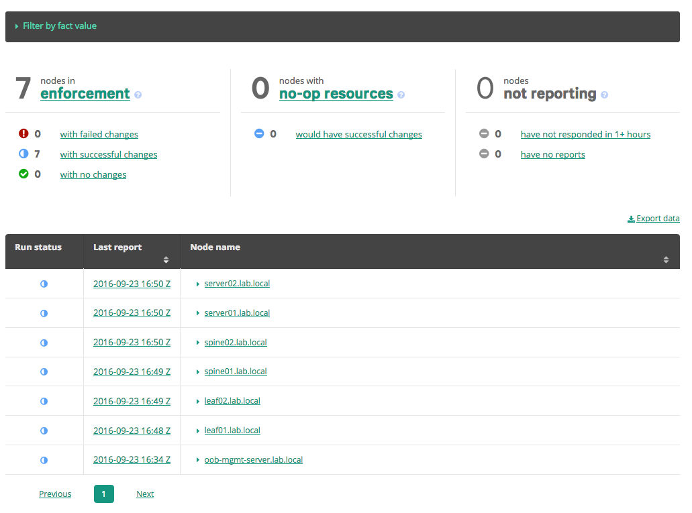

Before you start
----------------
If you don't already have a license for Puppet Enterprise, you can get a trial license
for deployments up to 10 devices for free by visiting
[https://puppet.com/download-puppet-enterprise](https://puppet.com/download-puppet-enterprise).
Copy the download URL for the Puppet Enterprise Master for Ubuntu 16.04.

Installing Puppet Enterprise
----------------------------
Before running this demo, install [VirtualBox](https://www.virtualbox.org/wiki/Download_Old_Builds) and [Vagrant](https://releases.hashicorp.com/vagrant/). The currently supported versions of VirtualBox and Vagrant can be found on the [cldemo-vagrant](https://github.com/cumulusnetworks/cldemo-vagrant).

The reference topology by default only gives 1G of RAM to the `oob-mgmt-server`.
You will need to increase the RAM for the `oob-mgmt-server` to 3G in order for
Puppet Enterprise to install. This is done in the `sed` line below.

    git clone https://github.com/cumulusnetworks/cldemo-vagrant
    cd cldemo-vagrant
    # edit Vagrantfile and replace v.memory for the oob-mgmt-server from 1024 to 2048
    sed -i 's/v.memory = 1024/v.memory = 3072/g' Vagrantfile
    vagrant up oob-mgmt-server oob-mgmt-switch leaf01 leaf02 spine01 spine02 server01 server02
    vagrant ssh oob-mgmt-server
    sudo su - cumulus
    wget 'https://pm.puppetlabs.com/cgi-bin/download.cgi?dist=ubuntu&rel=16.04&arch=amd64&ver=latest' -O puppet-enterprise.tar.gz
    wget -O - https://downloads.puppetlabs.com/puppetlabs-gpg-signing-key.pub | gpg --import
    tar xvf puppet-enterprise.tar.gz
    cd puppet-enterprise-*
    sudo ./puppet-enterprise-installer
    # press enter to install the webserver

*In a new terminal, we'll call terminal 2*

    ssh -L 9000:localhost:3000 vagrant@localhost -p 2222 -o StrictHostKeyChecking=no
    # password is vagrant

Leave this terminal open for the duration of the demo - this creates an SSH
tunnel that will allow you to use the Puppet website from your host machine.
In Firefox or Chrome, navigate to [https://127.0.0.1:9000](https://127.0.0.1:9000).
You will receive an error message stating that your connection is not secure.
Go to Advanced and either add an exception or tell it to proceed to localhost
anyway.

 * Choose Monolithic Install.
 * Set the FQDN to oob-mgmt-server.lab.local
 * Set the admin password to `CumulusLinux!`

Don't worry about the validation warnings. Just click on Deploy Now.

After successful installation, switch to terminal 2.

    exit
    ssh -L 9000:localhost:443 vagrant@localhost -p 2222 -o StrictHostKeyChecking=no
    # password is vagrant

Navigate back to [https://127.0.0.1:9000](https://127.0.0.1:9000) to access
the Puppet Enterprise dashboard.

Configuring Agents
------------------
Before you can install the puppet agent on Cumulus, you need to pre-fetch the
agent package for Debian 8 (Jessie). In the web interface, go to Nodes -
Classification > Classes, and add the `pe_repo::platform::debian_8_amd64` class.
Commit the changes. Note that the changes do not take effect until a Puppet
run, which we trigger in the next step.

In the terminal that you ran the puppet installer in.

    cd ~
    git clone https://github.com/cumulusnetworks/cldemo-puppet-enterprise
    cd cldemo-puppet-enterprise
    sudo cp platform_check.bash.erb /opt/puppetlabs/puppet/modules/pe_repo/templates/partials/platform_check.bash.erb
    # this is a workaround until puppet enterprise updates their installer to recognize cumulus linux 3.0
    sudo puppet agent -t
    ssh leaf01 'curl -k https://oob-mgmt-server.lab.local:8140/packages/current/install.bash | sudo bash'
    ssh leaf02 'curl -k https://oob-mgmt-server.lab.local:8140/packages/current/install.bash | sudo bash'
    ssh spine01 'curl -k https://oob-mgmt-server.lab.local:8140/packages/current/install.bash | sudo bash'
    ssh spine02 'curl -k https://oob-mgmt-server.lab.local:8140/packages/current/install.bash | sudo bash'
    ssh server01 'curl -k https://oob-mgmt-server.lab.local:8140/packages/current/install.bash | sudo bash'
    ssh server02 'curl -k https://oob-mgmt-server.lab.local:8140/packages/current/install.bash | sudo bash'

    ssh leaf01 'sudo systemctl start puppet.service'
    ssh leaf02 'sudo systemctl start puppet.service'
    ssh spine01 'sudo systemctl start puppet.service'
    ssh spine02 'sudo systemctl start puppet.service'

Navigate to Nodes - Unsigned Certificates to see the nodes you installed the
agents on (you may need to refresh the page to see them). Accept all of the
certificates.

Configure BGP on all of the agents
----------------------------------
Download our puppet manifests that install a BGP fabric over our spines, leaves,
and servers. We verify connectivity over the fabric by downloading a file from
a webserver installed on server02.

    cd ~
    git clone https://github.com/cumulusnetworks/cldemo-automation-puppet
    cd cldemo-automation-puppet
    sudo su
    rm -rf /etc/puppetlabs/code/environments/production
    ln -s  /home/cumulus/cldemo-automation-puppet/ /etc/puppetlabs/code/environments/production
    exit
    ssh leaf01 'sudo puppet agent -t'
    ssh leaf02 'sudo puppet agent -t'
    ssh spine01 'sudo puppet agent -t'
    ssh spine02 'sudo puppet agent -t'
    ssh server01 'sudo puppet agent -t'
    ssh server02 'sudo puppet agent -t'
    ssh server01
    wget 172.168.2.101
    exit

After running this test, you can look at the puppet enterprise dashboard and
see the logs from the applied configuration. You can review the network
configuration of each switch by looking at the facts of the node, and even
trigger new Puppet runs from the dashboard.

